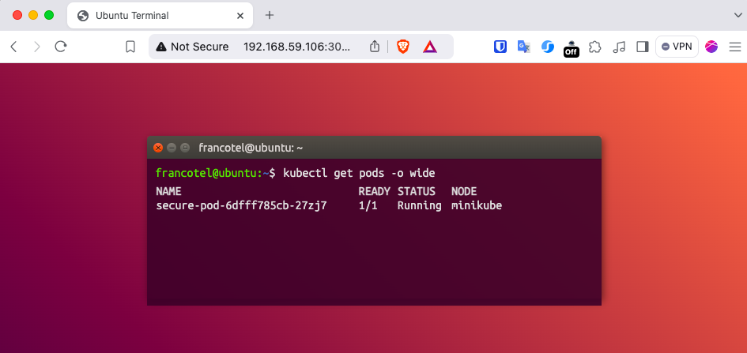

# 📦 Pod Info  
**Pod Info** is a lightweight Docker image built with Nginx and Alpine 🐳. It dynamically shows the Kubernetes pod name and node name 🖥️ on a webpage, making it a simple and effective tool to verify your Kubernetes setup 🚀.  

<div style="text-align: center;">
      
</div>

## ✨ Features  
- 📝 Displays **Pod Name** and **Node Name** dynamically based on environment variables.  
- ⚡ Built with a lightweight base image (`nginx:alpine`) for fast startup and minimal resource usage.  
- 🔄 Includes default values for pod and node names if none are set.  
- 🎨 Clean and simple HTML/CSS design for easy customization.  

## 🚀 How to Use  
### 1️⃣ Pull the Image:  
```bash
docker pull francotel/pod-info:v1
```
